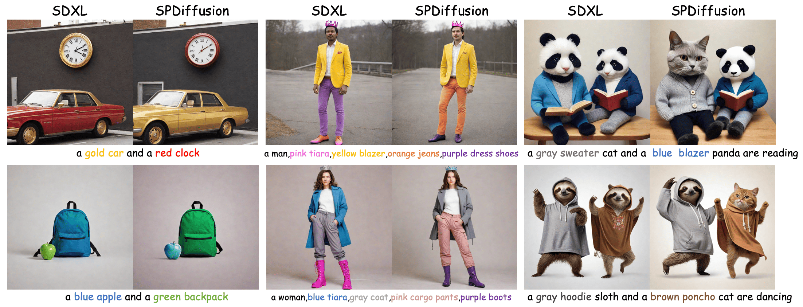
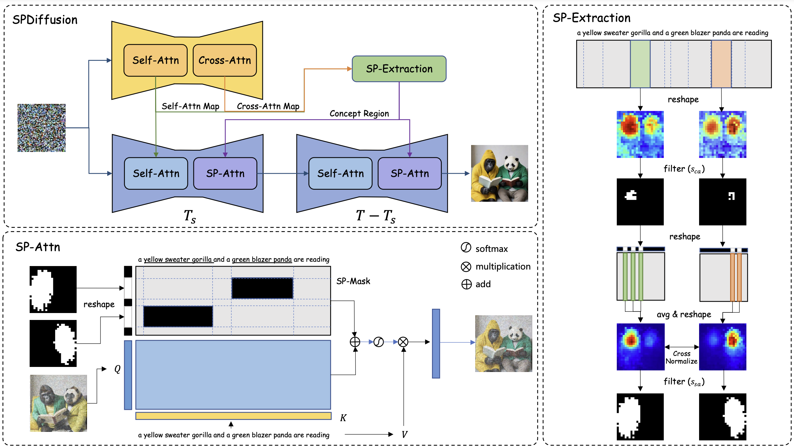

# 🌟 SPDiffusion: Semantic Protection Diffusion Models for Multi-concept Text-to-image Generation


## 📑 Introduction

> **SPDiffusion: Semantic Protection Diffusion Models for Multi-concept Text-to-image Generation**
>
> [Yang Zhang](https://github.com/zy1xxx), [Rui Zhang](https://www.ict.ac.cn/sourcedb/cn/jssrck/202111/t20211108_6246309.html), [Xuecheng Nie](https://niexc.github.io/), [Haochen Li](https://github.com/Therock90421), [Jikun Chen](), [Yifan Hao](), [Xin Zhang](), [Luoqi Liu]() , [Ling Li]()
>
> 📚[arXiv](https://arxiv.org/abs/2409.01327)

This paper proposes a unified approach to address the challenges of improper attribute binding and concept entanglement. We introduce a novel method, SPDiffusion, which detects concept regions from both cross- and self-attention maps, while safeguarding these regions from interference by irrelevant tokens.

For technical details, please refer to our paper.



## 🚀 Usage

### Requirements
```
torch>=2.0.1
diffusers>=0.29.0
stanza==1.8.2
nltk==3.8.1
```

### Pipeline
```
from SPD_Pipeline import SPDiffusionPipeline
import torch
pipe = SPDiffusionPipeline.from_pretrained("SG161222/RealVisXL_V4.0").to("cuda")
generator = torch.Generator(device="cuda").manual_seed(2048)
image=pipe("A red book and a yellow vase",run_sdxl=True,generator=generator,cross_threshold=0.9,self_threshold=0.1).images[0]
image.save("result.png")
```

### Pipeline Parameters
The parameters for the SPDiffusion pipeline are as follows:
- ``prompt`` text prompt for generation
- ``cross_threshold`` threshold value for cross attention map
- ``self_threshold`` threshold value for self attention map
- ``st_step`` layout keeping and SP-Extration steps
- ``filter_loc`` layers for SP-Extration 
- ``run_sdxl`` generate original sdxl image

## 🙏 Acknowledgments

This project builds upon valuable work and resources from the following repositories:

- [Magnet](https://github.com/I2-Multimedia-Lab/Magnet) 
- [🤗 Diffusers](https://github.com/huggingface/diffusers) 

We extend our sincere thanks to the creators of these projects for their contributions to the field and for making their code available. 🙌


